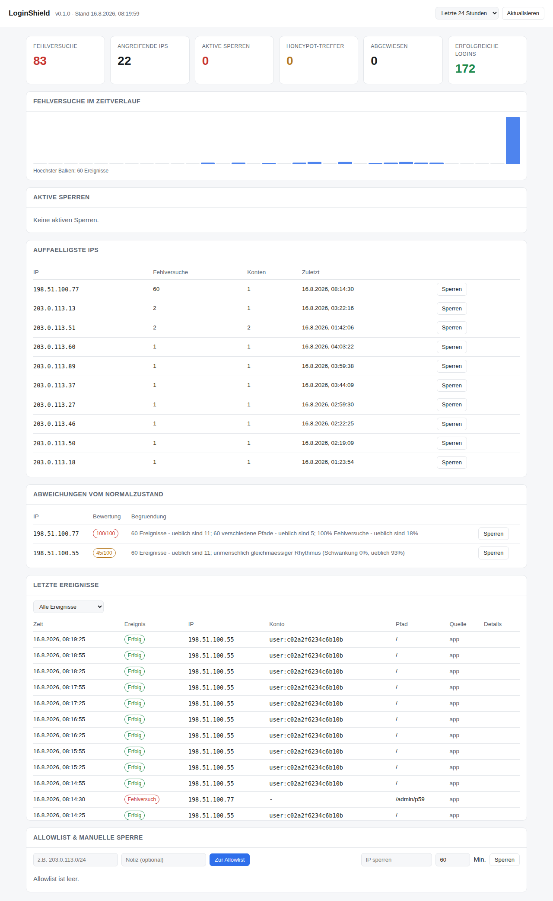

# LoginShield

Schutz gegen Brute-Force- und automatisierte Angriffe auf Logins und Server.
Erkennt Angriffsmuster, sperrt die IP automatisch mit ansteigender Dauer und
zeigt die Lage in einem Web-Dashboard. Vier Schichten: Erkennungsregeln,
Honeypot, Anfrage-Firewall und eine Anomalie-Erkennung, die den
Normalzustand deines Servers lernt.

**Ohne externe Abhängigkeiten** – nur Python 3.9+ und die Standardbibliothek.
Nutzbar als Bibliothek, als Middleware, als Log-Wächter und über die
Kommandozeile.



### Klickbare Vorschau

[`docs/demo.html`](docs/demo.html) ist eine bedienbare Version dieser
Oberfläche &mdash; einzelne Datei, keine Installation. Herunterladen und
doppelklicken, dann einen Angriff auslösen und zusehen, wie die Sperre
zuschnappt.

Über GitHub Pages wird sie automatisch veröffentlicht, sobald du unter
*Settings → Pages → Source* einmalig **GitHub Actions** auswählst:
`https://levirob2015.github.io/L-vi/`

**Auf dem iPad:** Die Seite in Safari öffnen und über *Teilen → Zum
Home-Bildschirm* ablegen – sie bekommt dann ein eigenes Symbol und startet
ohne Browserleiste, wie eine App. Die Schutzsoftware selbst läuft dort
nicht: sie schützt einen Server, kein Tablet.

---

## Schnellstart

```bash
git clone https://github.com/Levirob2015/L-vi.git
cd L-vi
pip install -e .          # oder einfach: export PYTHONPATH=$PWD

loginshield init          # Konfiguration + Dashboard-Token anlegen
loginshield demo          # Beispieldaten, damit man etwas sieht
loginshield serve         # Dashboard auf http://127.0.0.1:8787
```

Oder direkt die lauffähige Beispielanwendung mit echtem Login ausprobieren:

```bash
python examples/demo_login_app.py
# Login:     http://127.0.0.1:8080   (anna / geheim123)
# Dashboard: http://127.0.0.1:8787
```

Fünfmal ein falsches Passwort eingeben – danach ist die IP gesperrt, auch mit
dem richtigen Passwort.

---

## Was erkannt wird

| Muster | Beschreibung | Standard-Schwelle |
|---|---|---|
| **Brute Force** | Viele Fehlversuche von einer IP | 5 Versuche / 5 Min |
| **Password Spraying** | Eine IP probiert viele verschiedene Konten | 5 Konten / 10 Min |
| **Gezielter Kontoangriff** | Viele Fehlversuche gegen *ein* Konto, verteilt über viele IPs | 10 Versuche / 15 Min |
| **Request-Flut** | Zu viele Anfragen pro IP (unabhängig vom Login) | 60 / Min |
| **Honeypot** | Zugriff auf eine vorgetäuschte Schwachstelle | **1 Treffer** |
| **Netzsperre** | Mehrere gesperrte IPs aus demselben Adressblock | 4 IPs / 1 Std |
| **Angriffsmuster** | SQL-Injection, Path Traversal, Log4Shell, Scanner | ab 8 Punkten |
| **Anomalie** | Verhalten, das für *diesen* Server unüblich ist | ab 40/100 |
| **Verteilter Angriff** | Viele Adressen, jede für sich unauffällig | Gesamtsicht |

Spraying braucht eine eigene Regel: Wer pro Konto nur zwei Passwörter probiert,
löst die klassische Fehlversuchs-Schwelle nie aus – über zwanzig Konten hinweg
ist es trotzdem ein Angriff.

**Die Netzsperre** ist die Antwort auf Botnetze: Wird eine IP gesperrt, kommt
die nächste Anfrage oft vom Nachbarn im selben Adressblock. Häufen sich die
Sperren dort, wird der ganze Block gesperrt (`/24` bei IPv4, `/64` bei IPv6) –
inklusive Adressen, die noch gar nicht aufgefallen sind.

Ein Netz, das eine Adresse deiner Allowlist enthält, wird dabei **nie**
gesperrt. Sonst sperrt ein einziges `/24` das eigene Büro mit aus.

**Sperrdauer steigt an:** erste Sperre 15 Minuten, dann 30, 60, 120 … bis
maximal 24 Stunden. Frühere Sperren zählen 7 Tage lang mit. Ein hartnäckiger
Angreifer sperrt sich damit selbst immer länger aus, ein Nutzer mit
Zahlendreher wartet nur kurz.

---

## Der Honeypot: die Falle

Ein Angreifer sucht, bevor er Passwörter durchprobiert, erst nach leichter
Beute: `/.env`, `/wp-admin`, `/phpmyadmin`, `/.git/config`. Diese Pfade
existieren nicht – aber sie **antworten**, als gäbe es sie. Damit ist der
Angreifer entlarvt, bevor er den echten Login überhaupt gesehen hat.

Drei Fallen greifen ineinander:

### 1. Gefälschte Schwachstellen

28 Köderpfade sind eingebaut (`loginshield honeypot --list`). Ein Aufruf
genügt für 24 Stunden Sperre – es gibt keinen harmlosen Grund, `/.env`
abzurufen. Der Angreifer bekommt eine glaubwürdige Antwort:

```
$ curl https://deine-seite.de/.env
APP_ENV=production
DB_HOST=10.0.0.14
DB_USERNAME=svc_backup
DB_PASSWORD=Srv5e751856a91e!
```

Kein 403, keine Fehlermeldung – er merkt nichts. Ab jetzt kommt er nirgends
mehr durch.

### 2. Untergeschobene Zugangsdaten (Honeytoken)

Die Zugangsdaten in den gefälschten Dateien sind nirgends gültig. Taucht
dieser Benutzername später am echten Login auf, ist das kein Zufall –
derjenige hat die Köderdatei gelesen. Sofortige Sperre:

```python
if guard.honeypot.is_honeytoken(username):
    guard.honeypot.trigger(ip, route="/login", reason=Reason.HONEYPOT_TOKEN)
    return response(401, "Benutzername oder Passwort falsch.")
```

Wichtig: dem Angreifer dieselbe Meldung zeigen wie bei einem falschen
Passwort. Er soll nicht merken, dass er in eine Falle gelaufen ist.

`loginshield honeypot --credentials` zeigt die Daten deiner Installation –
sie werden stabil aus deinem Schlüssel abgeleitet, sind also bei jedem
Server andere.

### 3. Unsichtbares Formularfeld

Ein Eingabefeld, das Menschen nicht sehen. Bots füllen jedes Feld aus, das
sie finden:

```python
form_html = guard.honeypot.hidden_field_html()   # ins Login-Formular

if guard.honeypot.check_hidden_field(form):      # ausgefüllt = Bot
    guard.honeypot.trigger(ip, reason=Reason.HONEYPOT_FIELD)
```

### Einbinden

In der Middleware ist der Honeypot **automatisch aktiv** – die Köderpfade
werden abgefangen, bevor die Anwendung sie sieht. Fallen 2 und 3 brauchen
die zwei Aufrufe oben im Login-Handler, weil nur dort das Formular bekannt ist.

Als eigenständiger Dienst auf einem ungenutzten Port – dann ist *jeder*
Zugriff ein Scan:

```bash
loginshield honeypot --port 8081
```

Der Server tarnt sich als gewöhnlicher Apache und liefert je nach Pfad ein
gefälschtes phpMyAdmin, einen SQL-Dump oder ein Verzeichnislisting.

### Bevor du ihn scharf schaltest

Prüfe, ob ein Köder mit einer echten Route kollidiert – sonst sperrst du
deine eigenen Nutzer aus:

```python
guard.honeypot.conflicts_with(["/admin", "/debug", "/login"])
# -> ['/admin'] : diesen Pfad in honeypot.exclude_paths eintragen
```

Die Allowlist gilt weiterhin: Dein eigener Sicherheitsscanner löst den
Treffer aus, wird protokolliert, aber nicht gesperrt.

Der Honeypot ist rein defensiv. Er reagiert nur auf Zugriffe, die von selbst
kommen, sammelt keine Daten über den Angreifer und unternimmt nichts gegen
ihn – er sperrt ihn aus, mehr nicht.

---

## Einbinden in eine eigene Anwendung

### Direkt (funktioniert mit jedem Framework)

Drei Aufrufe, mehr braucht es nicht:

```python
from loginshield import Guard, load_config

guard = Guard(load_config())

def login(request):
    ip = guard.resolve_ip(request.remote_addr, request.headers.get("X-Forwarded-For"))

    # 1. Vor der Passwortprüfung: darf diese IP überhaupt?
    decision = guard.check(ip, identity=request.form["username"], route="/login")
    if not decision.allowed:
        return response(decision.status_code, "Zu viele Versuche.",
                        headers={"Retry-After": str(decision.retry_after)})

    if passwort_stimmt:
        guard.record_success(ip, identity=username)   # setzt die Zähler zurück
        return redirect("/")

    # 2. Fehlschlag melden – die Antwort sagt, ob jetzt gesperrt wurde
    result = guard.record_failure(ip, identity=username, route="/login")
    return response(401, "Benutzername oder Passwort falsch.")
```

### FastAPI / Starlette / jedes ASGI-Framework

```python
from loginshield import Guard, load_config
from loginshield.middleware import ShieldMiddleware

guard = Guard(load_config())
app.add_middleware(ShieldMiddleware, guard=guard,
                   login_paths=["/login", "/api/auth/*"],
                   exempt_paths=["/health", "/static/*"])
```

Die Middleware erkennt Fehlschläge am HTTP-Status (401/403/422). Für die
Spraying-Erkennung braucht sie zusätzlich den Benutzernamen:

```python
def identity_from_scope(scope):
    return dict(scope["headers"]).get(b"x-username", b"").decode() or None
```

### Flask / Django / WSGI

```python
from loginshield.middleware import WSGIShield

app.wsgi_app = WSGIShield(app.wsgi_app, guard, login_paths=["/login"])
```

---

## SSH und Webserver schützen (ohne Codeänderung)

`loginshield watch` liest Logdateien mit und meldet Fehlversuche an dieselbe
Engine – wie fail2ban, nur mit Dashboard:

```bash
loginshield watch --path /var/log/auth.log --format sshd
```

Dauerhaft über die Konfiguration:

```yaml
logwatch:
  - path: /var/log/auth.log
    format: sshd
  - path: /var/log/nginx/access.log
    format: nginx
    path_filter: /login
    failure_statuses: [401, 403]
```

Der Honeypot greift auch hier: Ruft ein Scanner `/.env` ab, antwortet nginx
mit 404 – für den Log-Wächter ist es trotzdem ein Treffer, unabhängig vom
Status. So werden Scans erkannt, ohne dass die Anwendung etwas davon merkt.

Eigene Anwendungslogs mit `format: custom` und einem Regex, der die Gruppen
`(?P<ip>...)` und optional `(?P<identity>...)` enthält.
Logrotation wird automatisch erkannt.

Damit die IP auch auf Netzwerkebene blockiert wird, siehe den nächsten
Abschnitt.

---

## Firewall: Sperren auf Netzwerkebene

Ohne Firewall gilt eine Sperre nur **innerhalb der Anwendung**: Der Angreifer
bekommt HTTP 403, seine Pakete erreichen den Server aber weiterhin – und
andere Dienste wie SSH sind davon gar nicht berührt. Mit Firewall kommt die
IP an keinen Port mehr heran.

```bash
sudo loginshield firewall --setup     # eigene Tabelle/Kette anlegen
loginshield firewall --status         # prüfen
```

Dann in der Konfiguration:

```yaml
firewall:
  enabled: true
  backend: auto        # nftables > iptables > ufw, in dieser Reihenfolge
  sync_on_start: true
```

Ab jetzt landet jede Sperre automatisch auch in der Firewall – egal ob sie
durch Brute Force, den Honeypot oder von Hand entstanden ist.

### Backends

| Backend | Verfahren | Ablauf der Sperre |
|---|---|---|
| **nftables** | Eigene Tabelle mit `timeout`-Sets | **Die Firewall selbst** |
| **iptables** | Eigene Kette `LOGINSHIELD` in INPUT | LoginShield entfernt die Regel |
| **ufw** | `ufw insert 1 deny from IP` | LoginShield entfernt die Regel |
| **command** | Deine eigenen Kommandos | Deine Sache |

**nftables ist die beste Wahl**, weil die Sperre dort eine eigene Ablaufzeit
hat: Selbst wenn LoginShield abstürzt, bleibt niemand dauerhaft ausgesperrt.

### Was angelegt wird

`--setup` fasst nur eine eigene Struktur an und lässt bestehende Regeln in
Ruhe:

```
table inet loginshield {
    set blocked4 { type ipv4_addr; flags timeout; }
    set blocked6 { type ipv6_addr; flags timeout; }
    chain input {
        type filter hook input priority -10; policy accept;
        ip  saddr @blocked4 drop
        ip6 saddr @blocked6 drop
    }
}
```

`policy accept` ist wichtig: Diese Kette **verwirft nur, was auf der
Sperrliste steht**. Sie kann dich nicht aussperren, wenn etwas schiefgeht.

### Abgleich nach einem Neustart

Nach einem Reboot sind nftables-/iptables-Regeln weg, die Sperren in der
Datenbank aber noch gültig. `sync_on_start: true` schreibt sie beim Start
zurück; von Hand geht es mit:

```bash
loginshield firewall --sync
```

Der Abgleich läuft in beide Richtungen: Einträge, die LoginShield nicht mehr
kennt, werden aus der Firewall entfernt – sonst bliebe jemand für immer
ausgesperrt, dessen Sperre längst abgelaufen ist.

### Befehle

```
loginshield firewall --status       Backend und Zustand anzeigen
loginshield firewall --selftest     Anbindung an einer Testadresse prüfen
loginshield firewall --setup        Tabelle/Kette anlegen
loginshield firewall --sync         aktive Sperren übertragen
loginshield firewall --list         gesperrte IPs in der Firewall
loginshield firewall --clear --yes  nur die eigenen Einträge entfernen
```

### Funktioniert es wirklich?

Das ist die Frage, die man sonst erst beim ersten echten Angriff beantwortet
bekommt. `--selftest` sperrt eine Testadresse aus dem Dokumentationsbereich,
sieht in der Firewall nach, ob sie angekommen ist, und entfernt sie wieder:

```
$ loginshield firewall --selftest
  + 192.0.2.201 gesperrt
  + in der Firewall wiedergefunden
  + wieder entsperrt
  + Rückstandsfrei – die Anbindung funktioniert.
```

Schlägt ein Schritt fehl, steht dort warum. `--status` weist außerdem von
sich aus auf die häufigen Stolpersteine hin: fehlendes Werkzeug, fehlende
Root-Rechte, nicht eingerichtete Tabelle, aktiver Trockenlauf.

Jeder Befehl versteht `--dry-run`: Dann werden die Kommandos nur angezeigt,
das System bleibt unverändert.

### Sicherheitsnetze

* **Kommandos laufen ohne Shell**, mit fester Argumentliste. Eine IP kann
  niemals als Shell-Code enden – das ist die klassische Lücke selbstgebauter
  fail2ban-Klone.
* **`127.0.0.1` und `::1` werden nie gesperrt.** Das würde den Server von
  seinen eigenen Diensten abschneiden.
* **Die Allowlist gilt zuerst.** Was dort steht, kommt gar nicht erst bis
  zur Firewall.
* **Fehler brechen nichts ab.** Fehlen Root-Rechte, wird das protokolliert –
  die Sperre in der Anwendung gilt trotzdem weiter.
* **`--clear` fragt nach** und entfernt nur die eigene Tabelle bzw. Kette.

Braucht der Dienst Root-Rechte für die Firewall? Entweder als root laufen
lassen, oder `sudo: true` setzen und in `/etc/sudoers.d/` gezielt nur `nft`
für den Dienstbenutzer freigeben. `sudo -n` wird verwendet, es wird also nie
interaktiv nach einem Passwort gefragt.


---

## Zwei Firewalls

Die beiden Ebenen sehen völlig Verschiedenes – und decken sich gegenseitig ab:

| | **System-Firewall** | **Anfrage-Firewall** |
|---|---|---|
| Sieht | die Absenderadresse | den *Inhalt* der Anfrage |
| Blockt | Pakete, für alle Dienste | einzelne Anfragen an deine App |
| Greift bei | bekannten Angreifern | dem Angriff selbst, beim ersten Mal |
| Werkzeug | nftables / iptables / ufw | eingebautes Regelwerk |

Ein Angreifer mit frischer IP kommt an der System-Firewall vorbei – sie kennt
ihn ja noch nicht. Die Anfrage-Firewall erkennt ihn trotzdem, weil sie sieht,
**was** er versucht:

```
$ loginshield filter --test "/x?id=1' OR '1'='1"

Regel           Schwere  Bedeutung
--------------  -------  ------------------------------------
sql_tautologie  8        SQL-Injection (immer-wahr-Bedingung)

  Summe: 8 (Schwelle: 8)
  -> Würde gesperrt (block)
```

Erkannt werden unter anderem SQL-Injection, Path Traversal, Log4Shell,
Kommando-Einschleusung, PHP-Wrapper und die Kennungen bekannter
Angriffswerkzeuge (`sqlmap`, `nikto`, `nmap`, …). Auch mehrfach kodierte
Varianten: `%2527%2520OR` wird aufgelöst, bevor geprüft wird.

### Falschmeldungen sind hier gefährlicher als Lücken

Wer zu scharf filtert, sperrt echte Nutzer aus. Deshalb:

* **Jede Regel hat eine Schwere**, gesperrt wird erst ab einer Summe. Eine
  einzelne schwache Übereinstimmung genügt nie.
* **Nur Muster, die in normalem Verkehr praktisch nicht vorkommen.** Eine
  Suchanfrage nach `select the best option` oder ein Kommentar mit
  `drop by the office` löst nichts aus.
* **`action: log`** schreibt nur mit, ohne zu sperren – so lässt sich vor dem
  Scharfschalten sehen, was passieren würde:

```yaml
requestfilter:
  action: log          # erst beobachten, dann auf block umstellen
  exempt_paths: []     # eigene Routen ausnehmen
  disabled_rules: []   # einzelne Regeln abschalten
```

`loginshield filter --list` zeigt alle Regeln, `--test` prüft eine beliebige
URL dagegen.

### Beide System-Firewalls gleichzeitig

Zwei Schichten statt einer – fällt eine aus, hält die andere:

```yaml
firewall:
  enabled: true
  backend: [nftables, iptables]   # beide gleichzeitig bespielen
  verify: true                    # nach jeder Sperre nachsehen, ob sie ankam
```

`verify` deckt den heimtückischsten Fall auf: ein Kommando meldet Erfolg,
bewirkt aber nichts – man hält sich fälschlich für geschützt. Schlägt die
Nachprüfung fehl, wird ein zweiter Versuch unternommen und danach deutlich
protokolliert.


---

## Anomalie-Erkennung: was keine Regel kennt

Feste Regeln erkennen, was jemand vorher als Angriff beschrieben hat. Sie
sehen nicht, wenn etwas einfach **unüblich** ist.

Zwei Beispiele, die durch jede Regel fallen:

* Eine Adresse ruft 60 Pfade in 25 Minuten ab – unter jeder Schwelle, kein
  einziges verdächtiges Muster in der URL.
* Ein Programm meldet sich **erfolgreich** an, 40-mal, im Sekundentakt.
  Keine Fehlversuchsregel greift bei erfolgreichen Logins.

Diese Ebene lernt aus den eigenen Aufzeichnungen deines Servers, wie normaler
Verkehr dort aussieht, und meldet Abweichungen:

```
$ loginshield learn
Normalzustand aus 7 Tagen gelernt:
  Ereignisse            978
  Adressen              89
  Bekannte Pfade        6
  Fehlerquote           12.1%
  Aktive Stunden (UTC)  8, 9, 10, 11, 12, 13, 14, 15, 16, 17, 18, 19

$ loginshield anomalies
  198.51.100.77   100/100   [kritisch]
     - 60 Ereignisse - üblich sind 11             (+25)
     - 60 verschiedene Pfade - üblich sind 5      (+25)
     - 60 nie zuvor angefragte Pfade (100%)       (+20)
     - 100% Fehlversuche - üblich sind 12%        (+20)
     - aktiv zu einer sonst stillen Zeit          (+10)
```

### Was es *nicht* ist

**Kein neuronales Netz und kein Sprachmodell.** Beides wäre hier die falsche
Wahl: Verzögerung bei jeder Anfrage, keine Trainingsdaten, schwere
Abhängigkeiten – und vor allem Sperren, die niemand erklären kann.

Stattdessen lernt es unbeaufsichtigt aus den vorhandenen Daten: robuste
Statistik (Median und mittlere absolute Abweichung), Entropie, Neuheitsmaße.
Der Median statt des Mittelwerts ist dabei kein Detail – ein einzelner
Angriff im Lernzeitraum darf die Grundlinie nicht verschieben, sonst gilt er
hinterher als normal.

### Drei Grundsätze

**1. Ohne genug Daten wird nicht geurteilt.** Unter 200 Ereignissen von 20
Adressen sagt es offen, dass die Grundlage zu dünn ist – statt zu raten:

```
$ loginshield anomalies
Datengrundlage zu dünn: 20 Ereignisse von 8 Adressen (nötig: 200 von 20).
Es wird noch nicht geurteilt.

Lieber keine Aussage als eine geratene.
```

**2. Standardmäßig wird nur gemeldet, nicht gesperrt.** Eine statistische
Abweichung ist ein Verdacht, kein Beweis – ein Werbeschub sieht einem Angriff
zunächst ähnlich. Mit `action: block` lässt sich das ändern, dann greift es
ab 70 von 100 Punkten.

**3. Läuft von selbst.** Im Betrieb prüft sie alle fünf Minuten mit und
frischt den Normalzustand täglich auf (`evaluate_interval`, `relearn_hours`).
Ohne das liefe sie nur, wenn jemand von Hand nachsieht.

**4. Jedes Urteil ist begründet.** Kein Punktwert ohne die Signale, aus denen
er entstand, jeweils mit Beobachtung und Erwartung. Ein Test stellt sicher,
dass der Punktwert genau die Summe der genannten Signale ist – nichts
Verstecktes.

### Zehn Signale je Adresse

| Signal | Erkennt |
|---|---|
| `volumen` | ungewöhnlich viele Zugriffe |
| `pfadvielfalt` | Abklappern vieler Seiten |
| `pfadstreuung` | jede Seite genau einmal – ein Besucher kehrt zurück |
| `neue_pfade` | Pfade, die es hier noch nie gab |
| `fehlerquote` | Fehlversuchsanteil weit über dem Normalen |
| `kontenvielfalt` | viele verschiedene Konten |
| `kennung` | unbekanntes Programm |
| `uhrzeit` | Aktivität zu sonst stillen Zeiten |
| `takt` | maschinell hohe Geschwindigkeit |
| `regelmäßigkeit` | unmenschlich gleichmäßiger **Rhythmus** |

`regelmäßigkeit` ist dabei die schärfere Frage als `takt`: Ein Programm, das
alle 30 Sekunden anfragt, ist langsam – aber es schwankt um 0 %, während ein
Mensch um 90 % schwankt. Über die Geschwindigkeit allein wäre es nie
aufgefallen.

### Die Gesamtsicht: verteilte Angriffe

Der blinde Fleck jeder Einzelbewertung: Verteilen 200 Adressen je fünf
Fehlversuche unter sich auf, ist **keine davon** auffällig. In der Summe ist
es trotzdem ein Angriff. Deshalb gibt es eine zweite Sicht auf den Server als
Ganzes:

```
$ loginshield anomalies
  GESAMTLAGE   100/100   [kritisch]
     - 1000 Fehlversuche in 1.0h - üblich sind 2 pro Stunde     (+40)
     - 200 verschiedene Adressen mit Fehlversuchen - üblich 1   (+35)
     - 100% aller Anfragen sind Fehlversuche - üblich sind 14%  (+25)

  Keine einzelne Adresse fällt auf - der Angriff ist auf viele verteilt.
```

### Und was sie *nicht* meldet

Drei Vorkehrungen gegen Fehlalarme, die genauso wichtig sind wie die
Erkennung:

* **Beweislast.** Wer nur drei Zugriffe erzeugt hat, kann nicht „kritisch"
  sein – der Punktwert wird anteilig gedämpft (`min_evidence`).
* **Saubere Grundlinie.** Adressen, die im Lernzeitraum gesperrt wurden,
  fließen nicht ein. Sonst lernt das System den Angriff als normal und
  erkennt ihn beim nächsten Mal nicht mehr.
* **Nur Stunden mit Betrieb** zählen für die Erwartung. Sonst zieht jede
  stille Nacht den Vergleichswert auf null.

Die Gewichtung jedes Signals lässt sich in der Konfiguration anpassen.


---

## Kommandozeile

```
loginshield init                       Konfiguration + Token anlegen
loginshield serve [--watch]            Dashboard starten
loginshield watch --path DATEI         Logdateien mitlesen
loginshield honeypot                   Koeder-Server starten
loginshield honeypot --list            Koederpfade anzeigen
loginshield honeypot --credentials     untergeschobene Zugangsdaten zeigen
loginshield firewall --status          Firewall-Anbindung pruefen
loginshield firewall --setup           Firewall einrichten
loginshield firewall --sync            Sperren in die Firewall schreiben
loginshield firewall --selftest        prueft die Anbindung an einer Testadresse
loginshield filter --list              Regeln der Anfrage-Firewall anzeigen
loginshield filter --test URL          eine URL gegen die Regeln pruefen
loginshield learn                      Normalzustand lernen
loginshield anomalies                  Abweichungen anzeigen
loginshield status [--hours 24]        Lage-Überblick im Terminal
loginshield check IP                   Status einer IP abfragen
loginshield block IP|CIDR [--minutes]  IP oder ganzes Netz sperren
loginshield unblock IP                 Sperre aufheben
loginshield allow add|remove|list      Allowlist verwalten
loginshield export --format csv        Ereignisse exportieren
loginshield prune                      Alte Daten löschen
loginshield demo                       Beispieldaten erzeugen
```

`loginshield status` im Terminal:

```
Lage der letzten 24 Stunden
==============================================
  Fehlversuche       97
  Angreifende IPs    6
  Aktive Sperren     3
```

---

## Konfiguration

`loginshield init` legt eine kommentierte `loginshield.yaml` an (bzw. `.json`,
wenn PyYAML fehlt). Die wichtigsten Punkte:

```yaml
allowlist:              # wird NIE gesperrt – hier dein Büro/VPN eintragen
  - 127.0.0.1
trusted_proxies: []     # nur diesen IPs wird X-Forwarded-For geglaubt
identity_mode: hashed   # Benutzernamen nur als HMAC speichern
retention_days: 30

rules:
  ip_failure_threshold: 5
  ip_failure_window: 300
  block_base_seconds: 900
  block_escalation_factor: 2.0
  identity_action: throttle   # throttle | lock | off
  subnet_enabled: true        # Netzsperre gegen Botnetze
  subnet_threshold: 4         # so viele gesperrte IPs -> ganzes /24 sperren

honeypot:
  enabled: true
  block_seconds: 86400        # 24 Stunden nach einem Treffer
  extra_paths: []             # eigene Köder, z.B. ["/api/v1/debug*"]
  exclude_paths: []           # falls ein Köder mit einer echten Route kollidiert
  hidden_field: website       # Name des unsichtbaren Formularfelds

firewall:
  enabled: false              # true = Sperren auch auf Netzwerkebene
  backend: auto               # auto | nftables | iptables | ufw | command
  sync_on_start: true         # nach einem Neustart Sperren wiederherstellen
```

Geheimnisse lassen sich per Umgebungsvariable aus der Datei heraushalten:
`LOGINSHIELD_DB`, `LOGINSHIELD_TOKEN`, `LOGINSHIELD_HMAC_KEY`.

### Zwei Einstellungen, die wirklich zählen

**`trusted_proxies`** – Läuft die App hinter nginx/Cloudflare, kommt jede
Anfrage von der Proxy-IP; ohne diese Einstellung sperrt LoginShield im
Ernstfall den Proxy und damit alle Nutzer. Trage hier die Proxy-Adressen ein,
dann wird `X-Forwarded-For` ausgewertet – aber **nur** dann. Diesen Header
ungeprüft zu glauben wäre die größere Lücke: Er ist frei erfindbar, und
jeder Angreifer könnte damit die Sperre umgehen oder fremde IPs sperren lassen.

**`identity_action`** – Ein Konto nach zu vielen Fehlversuchen komplett zu
sperren (`lock`) klingt sicher, ist aber ein Denial-of-Service-Vektor: Wer
deinen Benutzernamen kennt, sperrt dich damit absichtlich aus. Standard ist
deshalb `throttle` – der Angriff wird ausgebremst, der echte Nutzer kommt
weiterhin rein.

---

## Dashboard

`loginshield serve` startet es auf `127.0.0.1:8787`. Es zeigt Kennzahlen,
den Zeitverlauf, aktive Sperren (mit Entsperren-Knopf), auffälligste IPs und
die letzten Ereignisse; Allowlist und manuelle Sperren lassen sich dort pflegen.

Zum Sicherheitsmodell:

* Standardmäßig lauscht es **nur lokal**. Für den Zugriff von außen ist ein
  Token Pflicht – die Konfiguration verweigert sonst den Start.
* Ändernde Aufrufe verlangen den Token im Header `X-Auth-Token`, nicht in der
  URL. Damit ist CSRF ausgeschlossen, und der Token landet nicht in
  Server-Logs oder im Browserverlauf.
* Token-Vergleich in konstanter Zeit, strikte CSP, keine externen Ressourcen.

Für den Zugriff von unterwegs besser einen SSH-Tunnel nehmen, als den Port
zu öffnen:

```bash
ssh -L 8787:127.0.0.1:8787 user@server
```

---

## Datenschutz

Benutzernamen werden standardmäßig **nicht im Klartext** gespeichert, sondern
als HMAC (`identity_mode: hashed`) – im Dashboard erscheint `user:a2935c74…`.
Korrelation über Angriffe hinweg bleibt möglich, aber die Angriffsdatenbank
enthält keine Kontonamen. Passwörter werden **nie** protokolliert, auch nicht
gehasht. Die Datenbankdatei wird mit Rechten `600` angelegt, Ereignisse nach
`retention_days` gelöscht (`loginshield prune`, z. B. per Cron).

---

## Was das schützt – und was nicht

LoginShield deckt eine bestimmte Angriffsklasse ab: **automatisiertes
Durchprobieren von Zugangsdaten und Anfrageschwemmen.** Das ist der mit
Abstand häufigste Angriff auf einen Server, der im Internet steht.

Es ersetzt nicht:

* **starke Passwörter und 2FA** – der wirksamste Login-Schutz überhaupt.
  LoginShield verschafft Zeit, es rettet kein Passwort „123456“.
* **Passwort-Hashing** mit argon2/bcrypt/scrypt in deiner Anwendung.
* **Schutz vor SQL-Injection, XSS, CSRF** – das gehört in den Anwendungscode.
* **Updates** von Betriebssystem und Abhängigkeiten.
* **Backups** – gegen Ransomware hilft nur eine Kopie, die offline liegt.
* **DDoS-Abwehr** auf Netzwerkebene; ein verteilter Angriff aus zehntausenden
  IPs braucht Schutz beim Provider. Auch die Firewall-Anbindung hilft dagegen
  nur begrenzt: Die Pakete kommen weiterhin an deiner Leitung an, sie werden
  nur nicht mehr verarbeitet.

Zwei praktische Hinweise: Trage deine eigene IP in die `allowlist` ein, bevor
du scharf schaltest – sonst sperrst du dich im Zweifel selbst aus (`loginshield
unblock DEINE-IP` hilft dann von der Konsole). Und teste die Schwellwerte
zuerst mit `loginshield demo` oder der Beispiel-App.

---

## Leistung und Grenzen

Gemessen auf einem gewöhnlichen Kern:

| Vorgang | Durchsatz |
|---|---|
| `guard.check()` – die Prüfung pro Anfrage | ~70.000 / s |
| Anfrage-Firewall pro Anfrage | ~110.000 / s |
| Anomalie-Prüfung (50.000 Ereignisse/Std) | 0,23 s, alle 5 Min |

Der Prüfpfad kostet also etwa 14 Mikrosekunden pro Anfrage – die Datenbank
ist dabei kein Engpass, obwohl jede Prüfung SQLite anfasst.

Was das System **nicht** leistet, damit die Erwartung stimmt:

* **Kein Schutz vor DDoS.** Die Pakete kommen weiter an deiner Leitung an.
* **Ein einzelner Prozess, eine SQLite-Datei.** Für mehrere Server bräuchte
  es eine gemeinsame Datenbank – das ist nicht gebaut.
* **Die Anomalie-Erkennung braucht Anlaufzeit.** Ohne 200 Ereignisse von 20
  Adressen urteilt sie nicht. Die anderen drei Schichten wirken sofort.


---

## Tests

```bash
pip install pytest
python -m pytest -q      # 353 Tests
```

Abgedeckt sind unter anderem: Erkennungsregeln und Eskalation, Honeypot in
allen drei Varianten (inklusive der Prüfung, dass die Köder sich nicht
verraten), Allowlist,
Rate-Limiting, IP-Auflösung hinter Proxys inklusive gefälschter Header,
Log-Parsing (sshd/nginx/custom) samt Logrotation, alle Firewall-Backends
gegen einen aufgezeichneten Kommando-Ausführer, ASGI- und WSGI-Middleware,
Dashboard-API mit Authentifizierung und die Kommandozeile. Zeitabhängige
Tests laufen über eine steuerbare Uhr – keine echten Wartezeiten.

---

## Aufbau

```
loginshield/
  engine.py      Guard – Erkennung und Entscheidungen (Herzstück)
  store.py       SQLite-Persistenz
  ratelimit.py   Gleitendes Zeitfenster
  netutils.py    IP-/CIDR-Logik, Proxy-Auflösung
  middleware.py  ASGI- und WSGI-Einbindung
  honeypot.py    die Falle: Köderpfade, Honeytoken, Köder-Server
  logwatch.py    Logdateien mitlesen
  dashboard.py   Web-Oberfläche
  firewall.py    System-Firewall (nftables, iptables, ufw, mehrere zugleich)
  requestfilter.py  Anfrage-Firewall: prüft den Inhalt der Anfragen
  anomaly.py     lernt den Normalzustand, meldet Abweichungen
  cli.py         Kommandozeile
examples/        lauffähige Beispielanwendung
tests/           Testsuite
```

## Lizenz

MIT
